# Visão Geral
O sistema realiza a análise sintática de sentenças, identificando e extraindo sujeitos e suas relações através de análise de dependências gramaticais. O processamento é feito através de busca em profundidade nos tokens (palavras) da sentença.

# Estruturas Principais

## Classe SujeitoRelacao
Representa a unidade básica de armazenamento para sujeitos e relações extraídos.

## Atributos Principais
- `sujeito`: `Deque<Token>` - Armazena os tokens que compõem o sujeito
- `relacao`: `Deque<Token>` - Armazena os tokens que compõem a relação
- `indiceNucleoSujeito`: `int` - Índice do token principal do sujeito
- `indiceNucleoRelacao`: `int` - Índice do token principal da relação
- `vetorBooleanoTokensSujeitoVisitados`: `Boolean[]` - Controle de tokens visitados durante extração do sujeito
- `vetorBooleanoTokensRelacaoVisitados`: `Boolean[]` - Controle de tokens visitados durante extração da relação

# Processo de Extração

1. [buscaSujeito()](#busca-de-sujeito)
2. [buscaRelacao()](#processamento-de-relações)
3. [moduloProcessamentoConjuncoesCoordenativasRelacao()](#processamento-de-conjunções-coordenadas)
4. [extraiClausulas()](#extração-de-cláusulas)
5. [extraiClausulasQuebradas()](#extração-de-clausulas-quebradas)
6. [moduloProcessamentoConjuncoesCoordenativasArg2()](#extração-de-conjunções-coordenadas-argumento-2)
7. [moduloExtracaoAposto()](#algoritmo-de-extração-de-aposto)
8. [adicionaArgumentoMarkAntesSujeito()](#adicionaargumentomarkantessujeito)
9. [moduloSubstituiApostoTransitividade()](#modulosubstituiapostotransitividade)
10. [moduloExtracaoVerboLigacao()](#moduloextracaoverboligacao)
11. [eliminaPreposicaoAntesSujeito()](#eliminapreposicaoantessujeito)
12. [excluiSraSujeitoErrado()](#excluisrasujeitoerrado)
13. [excluiSraRelacaoSemVerbo()](#excluisrarelacaosemverbo)
14. [eliminaTokenPontuacaoErrada()](#eliminatokenpontuacaoerrada)
15. [excluiExtracoesRepetidas()](#excluiextracoesrepetidas)

## Busca de Sujeito
```java  
public void buscaSujeito(boolean SC);  
```  

### Funcionamento
1. Inicializa vetor de controle para tokens visitados
2. Para cada token da sentença:
    - Verifica se é sujeito (`deprel` = "nsubj" ou "nsubj:pass")
    - Realiza busca em profundidade nos tokens filhos
    - Marca tokens relacionados ao sujeito principal

### Critérios de Inclusão no Sujeito
Token filho é incluído se sua relação de dependência (`deprel`) for:
- `nummod`: Modificador numérico
- `advmod`: Modificador adverbial
- `appos`: Aposição (quando `postag` é "NUM")
- `nmod`, `amod`, `dep`, `obj`: Modificadores nominais e objetos
- `det`: Determinantes
- `case`: Marcadores de caso
- `punct`: Pontuações específicas
- `conj`: Conjunções (exceto quando `postag` é "VERB")


### Exemplo de extração
O sujeito "O show" é extraído da sentença:

> O show ainda conta com as participações especiais dos cantores Zeca Pagodinho (apenas no DVD) e Dominguinhos.

<details>
<summary>Ver CoNLL-U</summary>

```conll
1	O	_	DET	DET	_	2	det	_	_
2	show	_	NOUN	NOUN	_	4	nsubj	_	_
3	ainda	_	ADV	ADV	_	4	advmod	_	_
4	conta	_	VERB	VERB	_	0	root	_	_
5	com	_	ADP	ADP	_	7	case	_	_
6	as	_	DET	DET	_	7	det	_	_
7	participações	_	NOUN	NOUN	_	4	nmod	_	_
8	especiais	_	ADJ	ADJ	_	7	amod	_	_
9	de	_	ADP	ADP	_	11	case	_	_
10	os	_	DET	DET	_	11	det	_	_
11	cantores	_	NOUN	NOUN	_	7	nmod	_	_
12	Zeca	_	PNOUN	PNOUN	_	11	appos	_	_
13	Pagodinho	_	PNOUN	PNOUN	_	12	flat	_	_
14	(	_	.	.	_	18	punct	_	_
15	apenas	_	ADV	ADV	_	18	advmod	_	_
16	en	_	ADP	ADP	_	18	case	_	_
17	o	_	DET	DET	_	18	det	_	_
18	DVD	_	NOUN	NOUN	_	4	parataxis	_	_
19	)	_	.	.	_	18	punct	_	_
20	e	_	CONJ	CONJ	_	21	cc	_	_
21	Dominguinhos	_	PNOUN	PNOUN	_	18	conj	_	_
22	.	_	.	.	_	18	punct	_	_

```

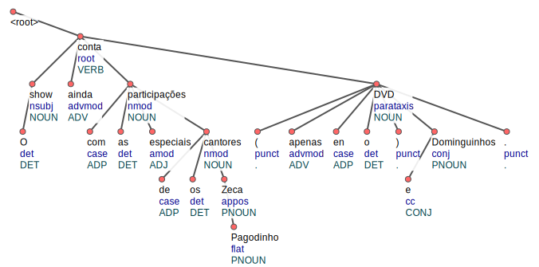

</details>

## Processamento de Relações


### Funcionamento Detalhado
1. **Inicialização**:
    - Cria um vetor booleano (`vetorBooleanoTokensVisitados`) para rastrear tokens processados.
    - Inicializa uma pilha (`pilhaAuxiliar`) para busca em profundidade iterativa (não recursiva).

2. **Iteração sobre Sujeitos**:
    - Para cada sujeito na lista `sujeitoRelacao`:
        - Obtém o token pai do sujeito (`paiSujeito`).
        - Define `paiSujeito` como núcleo inicial da relação (`sr.setIndiceNucleoRelacao`).

3. **Processamento da Pilha**:
    - Enquanto a pilha não estiver vazia:
        - Remove o token do topo (`elementoPilha`).
        - Itera sobre os filhos do token:
            - Verifica se o filho atende aos critérios de inclusão.
            - Se válido, marca como visitado e empilha para processamento posterior.
            - Reinicia o loop (`i = -1`) para reprocessar os filhos após adição de novos tokens.

### Critérios de Inclusão
Um token é incluído na relação se atender **uma** das condições:

#### Condição 1: Posição entre Sujeito e Relação
- **Deprels válidos**:  
  `aux:pass`, `obj`, `iobj`, `advmod`, `cop`, `aux`, `expl:pv`, `mark`
- **Pontuação**:  
  `punct`, exceto `,` e `--`

#### Condição 2: Após o Pai do Sujeito
- **Deprels válidos**:  
  `flat`, `expl:pv`
- **Pontuação**:  
  `punct` com valor `-`
- **Cláusula participial**:  
  `acl:part` (apenas se o primeiro token filho do pai do token atual também for `acl:part` 

### Exemplo de etração

Para a sentença "O livro foi escrito pelo autor.", o método:
1. Identifica "livro" como sujeito.
2. Processa "escrito" (pai do sujeito) como núcleo da relação.
3. Inclui "foi" (auxiliar `aux:pass`) na relação.

<details>
<summary>Ver CoNLL-U</summary>

```conll
1	O	_	DET	DET	_	2	det	_	_
2	livro	_	NOUN	NOUN	_	4	nsubj:pass	_	_
3	foi	_	AUX	AUX	_	4	aux:pass	_	_
4	escrito	_	VERB	VERB	_	0	root	_	_
5	por	_	ADP	ADP	_	7	case	_	_
6	o	_	DET	DET	_	7	det	_	_
7	autor	_	NOUN	NOUN	_	4	nmod	_	_
8	.	_	.	.	_	4	punct	_	_

```

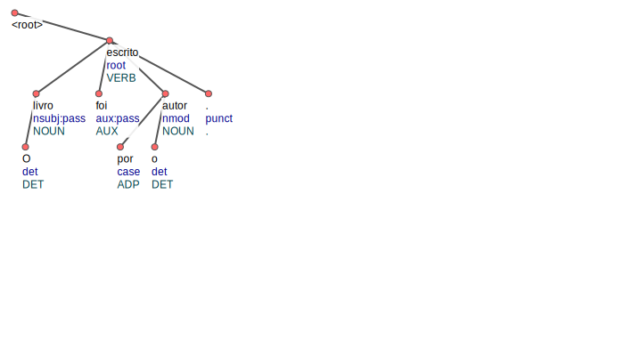

</details>

## Processamento de Conjunções Coordenadas

```java  
public void moduloProcessamentoConjuncoesCoordenativasRelacao();
```  


### Propósito
Este método identifica e processa conjunções coordenativas relacionadas ao predicado (relação), permitindo a extração de múltiplas proposições a partir de uma única sentença quando verbos estão coordenados.

### Algoritmo
1. **Inicialização**:
    - Cria um vetor booleano (`vetorBooleanoTokensVisitados`) para rastrear tokens processados
    - Inicializa uma pilha (`pilhaAuxiliar`) para busca em profundidade iterativa
    - Define uma flag (`flagExtracao`) para controlar quando adicionar tokens à relação

2. **Iteração Principal**:
    - Para cada estrutura sujeito-relação já identificada:
        - Obtém o token original do sujeito e seu token pai (verbo principal)
        - Cria uma cópia (`sr.retornaClone()`) para preservar a estrutura original
        - Define o token pai como núcleo inicial da relação e o empilha
        - Marca o identificador de módulo como 2 (`sr.setIdentificadorModuloExtracaoRelacao(2)`)

3. **Busca em Profundidade**:
    - Enquanto a pilha não estiver vazia:
        - Extrai o token do topo da pilha (`elementoPilha`)
        - Examina cada filho deste token:
            - Verifica posição relativa ao núcleo do sujeito e da relação
            - Aplica critérios específicos de dependência gramatical
            - Processa especialmente tokens com relação `conj` (conjunção)

4. **Tratamento Especial de Conjunções**:
    - Quando encontra um token com dependência `conj`:
        - Aplica a função `heuristicasVerificaConjRelacao()` para validar
        - Temporariamente altera a classificação para `conjCC`
        - Define novo núcleo de relação (`sr.setIndiceNucleoRelacao(tokenConj.getId())`)
        - Adiciona à lista de tokens da relação
        - Ativa `flagExtracao` para que tokens filhos também sejam incluídos
        - Restaura a classificação original `conj`

5. **Finalização**:
    - Quando `flagExtracao` está ativa e um nó folha é alcançado:
        - Copia o estado atual dos tokens visitados
        - Adiciona a nova estrutura sujeito-relação à lista principal
        - Reinicia a estrutura para potenciais novas extrações

### Critérios de Inclusão na Relação

Um token é incluído na relação em duas situações principais:

#### 1. Tokens Entre o Núcleo do Sujeito e da Relação

Com dependências:
- Auxiliares: `aux`, `aux:pass`
- Objetos: `obj`, `iobj`
- Modificadores: `advmod`
- Cópulas: `cop`
- Partículas: `expl:pv`
- Marcadores: `mark`
- Pontuação: `punct` (exceto vírgulas e traços duplos)

#### 2. Tokens Após o Pai do Sujeito

Com dependências:
- Nominal: `flat`
- Partículas: `expl:pv`
- Pontuação: `punct` (somente traço simples `-`)
- Cláusulas participiais: `acl:part` (condicionada por `verificaAclPartPrimeiroFilhoRelacao()`)
- Conjunções: `conj` (condicionada por `heuristicasVerificaConjRelacao()`)

### Diferença Entre `buscaRelacao()` e Este Método

- `buscaRelacao()` encontra relações diretas e simples (módulo 1)
- `moduloProcessamentoConjuncoesCoordenativasRelacao()` identifica relações adicionais conectadas por conjunções (módulo 2)

### Exemplo de Extração

**Entrada:** "Marshall foi expulso das próprias terras pela onda resultante de garimpeiros e nunca obteve lucro com sua descoberta."

<details>
<summary>Ver CoNLL-U</summary>

```conll
1	Marshall	_	PNOUN	PNOUN	_	3	nsubj:pass	_	_
2	foi	_	AUX	AUX	_	3	aux:pass	_	_
3	expulso	_	VERB	VERB	_	0	root	_	_
4	de	_	ADP	ADP	_	7	case	_	_
5	as	_	DET	DET	_	7	det	_	_
6	próprias	_	ADJ	ADJ	_	7	amod	_	_
7	terras	_	NOUN	NOUN	_	3	nmod	_	_
8	por	_	ADP	ADP	_	10	case	_	_
9	a	_	DET	DET	_	10	det	_	_
10	onda	_	NOUN	NOUN	_	3	nmod	_	_
11	resultante	_	ADJ	ADJ	_	10	amod	_	_
12	de	_	ADP	ADP	_	13	case	_	_
13	garimpeiros	_	NOUN	NOUN	_	10	nmod	_	_
14	e	_	CONJ	CONJ	_	16	cc	_	_
15	nunca	_	ADV	ADV	_	16	advmod	_	_
16	obteve	_	VERB	VERB	_	3	conj	_	_
17	lucro	_	NOUN	NOUN	_	16	obj	_	_
18	com	_	ADP	ADP	_	20	case	_	_
19	sua	_	DET	DET	_	20	det:poss	_	_
20	descoberta	_	NOUN	NOUN	_	16	nmod	_	_
21	.	_	.	.	_	3	punct	_	_

```

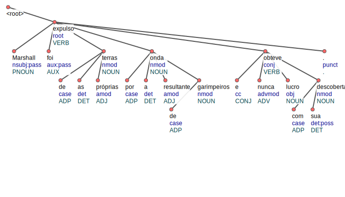

</details>

**Extrações produzidas:**
1. (Módulo 1) "Marshall" → "foi expulso"
2. (Módulo 2) "Marshall" → "nunca obteve"

A segunda extração é criada exclusivamente por este método, identificando "obteve" como uma conjunção coordenada de "expulso".

## Extração de Cláusulas

Realiza a extração do segundo argumento (arg2) das triplas sujeito-relação-argumento, processando os tokens que complementam a informação do predicado. Identifica e estrutura todos os componentes que formam o objeto direto, indireto e complementos do verbo.

### Parâmetros
- `SC` (Subordinate Clauses): Controla o processamento de cláusulas subordinadas
    - `true`: Processa e incorpora cláusulas subordinadas no argumento
    - `false`: Ignora o processamento detalhado de cláusulas subordinadas

### Algoritmo Detalhado

1. **Inicialização:**
    - Cria o vetor `vetorBooleanoTokensVisitados` para rastrear tokens já processados
    - Prepara uma pilha (`pilhaAuxiliar`) para busca em profundidade não-recursiva
    - Inicializa a variável de controle `flagExtracao` como `false`

2. **Iteração sobre Sujeitos e Relações:**
    - Para cada `SujeitoRelacaoArgumentos` no array `sujeitoRelacaoArgumentos`:
        - Obtém o token núcleo da relação via `sra.getSujeitoRelacao().getIndiceNucleoRelacao()`
        - Separa componentes da relação que devem ser tratados como argumentos através da função `separaParteTokensRelacaoEmArgumentos()`
        - Cria um novo objeto `Argumento` para armazenar os tokens extraídos

3. **Classificação de Tokens Filhos:**
    - Um token filho é considerado para extração caso sua relação de dependência (`deprel`) seja uma das seguintes:
        - Objetos e complementos: `nmod`, `xcomp`, `dobj`, `obj`, `iobj`
        - Modificadores: `nummod`, `advmod`, `amod`
        - Cláusulas relativas e aposições: `acl:relcl`, `appos`
        - Cláusulas subordinadas: `ccomp`, `advcl` (processadas dependendo do valor de `SC`)
        - Conjunções: `conj` (com verificação adicional para evitar duplicação)
        - Cláusulas participiais: `acl:part`
        - Outros: `dep`
        - Pontuações relevantes: `punct` (com validação específica via `pontuacaoValida()`)

4. **Busca em Profundidade:**
    - Para cada token filho válido:
        - Marca como visitado no vetor booleano
        - Adiciona à pilha para processamento posterior
        - Se for um nó folha (sem filhos não visitados), adiciona ao argumento:
          ```java
          adicionaPedacoArgumento(clausulasPercorridas, elementoPilha, vetorBooleanoTokensVisitados);
          ```

5. **Tratamento de Casos Especiais:**
    - **Conjunções (`conj`):**
        - Verifica se o token tem outros irmãos `conj` através de `verificaFilhoConj()`
        - Em caso positivo, aplica tratamento especial para evitar redundância via `trataCasoEspecialArg2ComConjuncao()`

    - **Cláusulas Subordinadas (`ccomp`, `advcl`):**
        - Quando `SC` é `true`, verifica se contém sujeito próprio com `verificaTokenFilhoSujeito()`
        - Cria apontamentos para estas cláusulas usando `realizaApontamentoArgumento()`

    - **Tokens Antes/Depois da Relação:**
        - Usa `verificaTokenPaiAntesDepoisNucleoRelacao()` para determinar a posição relativa
        - Adiciona tokens anteriores à relação em um array separado para processamento posterior
    

### Exemplo de Extração

**Entrada:** "Em tempos pré-históricos as cavernas protegiam os nossos antepassados das intempérides e dos animais selvagens."  
**Extração:** O argumento extraído contém toda a sequência "os nossos antepassados de as intempérides e de os animais selvagens".

<details>
<summary>Ver CoNLL-U</summary>

```conll
1	Em	_	ADP	ADP	_	2	case	_	_
2	tempos	_	NOUN	NOUN	_	0	root	_	_
3	pré	_	PRT	PRT	_	5	amod	_	_
4	-	_	.	.	_	5	punct	_	_
5	históricos	_	ADJ	ADJ	_	2	amod	_	_
6	as	_	DET	DET	_	7	det	_	_
7	cavernas	_	NOUN	NOUN	_	2	nsubj	_	_
8	protegiam	_	VERB	VERB	_	7	acl:part	_	_
9	os	_	DET	DET	_	11	det	_	_
10	nossos	_	DET	DET	_	11	det:poss	_	_
11	antepassados	_	NOUN	NOUN	_	8	obj	_	_
12	de	_	ADP	ADP	_	14	case	_	_
13	as	_	DET	DET	_	14	det	_	_
14	intempérides	_	NOUN	NOUN	_	11	nmod	_	_
15	e	_	CONJ	CONJ	_	18	cc	_	_
16	de	_	ADP	ADP	_	18	case	_	_
17	os	_	DET	DET	_	18	det	_	_
18	animais	_	NOUN	NOUN	_	14	conj	_	_
19	selvagens	_	ADJ	ADJ	_	18	amod	_	_
20	.	_	.	.	_	2	punct	_	_

```

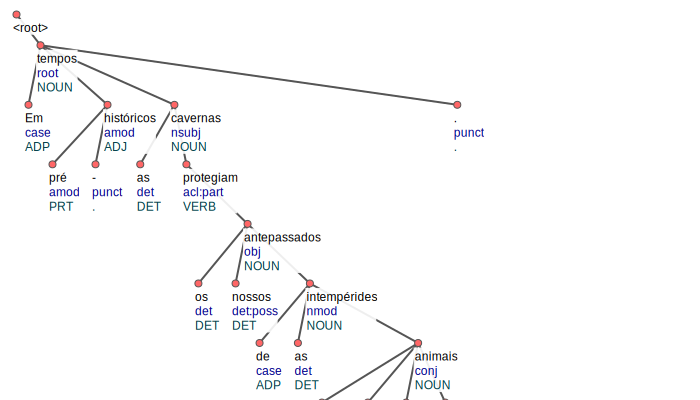

</details>

## Extração de Clausulas Quebradas

Este método complementa `extraiClausulas()` recuperando fragmentos importantes que foram "quebrados" na árvore sintática, especialmente advérbios, complementos circunstanciais e modificadores que não estão diretamente ligados ao núcleo verbal mas são essenciais para o sentido completo da proposição.

### Diferença em Relação a `extraiClausulas()`
Enquanto `extraiClausulas()` extrai argumentos diretamente ligados ao núcleo verbal, `extraiClausulasQuebradas()` foca em recuperar elementos "soltos" na árvore sintática que são tipicamente adjuntos adverbiais ou complementos circunstanciais, como informações de tempo, lugar, modo ou causa.

### Algoritmo Detalhado

1. **Inicialização:**
    - Cria o vetor `vetorBooleanoTokensVisitados` para rastrear tokens processados
    - Prepara uma pilha (`pilhaAuxiliar`) para busca em profundidade
    - Inicializa a flag `flagExtracao` como `false`
    - Define um array para armazenar argumentos identificados antes da relação (`clausulasAntesRelacao`)

2. **Iteração sobre Sujeitos e Relações:**
    - Para cada `SujeitoRelacaoArgumentos`:
        - Verifica se já possui um argumento extraído via `extraiClausulas()`
        - Obtém o token raiz da sentença (`sentence.getRootId()`)
        - Identifica tokens adjacentes que podem completar a informação da proposição

3. **Critérios Especiais de Inclusão:**
    - Além dos critérios usados em `extraiClausulas()`, aplica condições adicionais:
        - Tokens com relação `obl`, `advmod` ou `parataxis` ligados ao root mas não visitados
        - Elementos marcados com `nmod` ou `advcl` que são complementos circunstanciais
        - Tokens com dependência de `appos` que sejam explicações adicionais
        - Estruturas de data, tempo e localização que frequentemente ficam separadas

4. **Processamento de Elementos Temporais e Espaciais:**
    - Identifica e processa estruturas como:
        - Expressões de data: "em 24 de Maio de 1931"
        - Localizações: "na Universidade de Bonn"
        - Expressões temporais: "durante a década de 1980"
    - Utiliza funções auxiliares para concatenar tokens filhos:
      ```java
      retornaTokenConcatenadoSujeitoArgumentos(token, vetorBooleanoTokensVisitados)
      ```

5. **Integração com Extrações Existentes:**
    - Se um argumento já foi extraído para o SRA atual:
        - Verifica complementaridade entre as extrações
        - Evita redundância usando `verificaTokenArray()`
        - Integra os novos fragmentos preservando a ordem original dos tokens
    - Se não há argumento prévio:
        - Cria um novo objeto `Argumento` com os fragmentos recuperados

6. **Tratamento de Tokens Adjacentes:**
    - Processa tokens que aparecem perto do núcleo da relação na sentença original
    - Analisa se pertencem semanticamente à proposição usando validações de dependência
    - Usa a posição relativa na sentença para decidir sobre inclusão quando a árvore sintática é ambígua


### Exemplode de extração

**Entrada:** "Esse asteróide foi descoberto em 24 de Maio de 1931 por Cyril Jackson."
**Processo de extração:**
1. `extraiClausulas()` extrai "Esse asteróide foi descoberto por Cyril Jackson"
2. `extraiClausulasQuebradas()` identifica o fragmento "em 24 de Maio de 1931" e "por Cyril Jackson." separados e apresenta duas extrações mínimas

<details>
<summary>Ver CoNLL-U</summary>

```conll
1	Esse	_	DET	DET	_	2	det	_	_
2	asteróide	_	NOUN	NOUN	_	4	nsubj:pass	_	_
3	foi	_	AUX	AUX	_	4	aux:pass	_	_
4	descoberto	_	VERB	VERB	_	0	root	_	_
5	em	_	ADP	ADP	_	6	case	_	_
6	24	_	NUM	NUM	_	4	nmod	_	_
7	de	_	ADP	ADP	_	8	case	_	_
8	Maio	_	PNOUN	PNOUN	_	6	nmod	_	_
9	de	_	ADP	ADP	_	10	case	_	_
10	1931	_	NUM	NUM	_	8	nmod	_	_
11	por	_	ADP	ADP	_	12	case	_	_
12	Cyril	_	PNOUN	PNOUN	_	4	nmod	_	_
13	Jackson	_	PNOUN	PNOUN	_	12	flat	_	_
14	.	_	.	.	_	4	punct	_	_

```

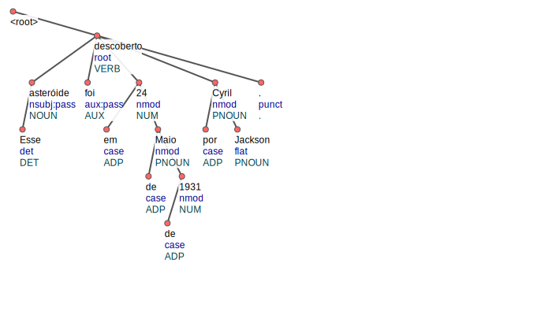

</details>

## Extração de Conjunções Coordenadas argumento 2

Responsável por identificar e processar conjunções coordenativas presentes no argumento 2 (objeto ou complemento) das extrações, gerando múltiplas triplas a partir de estruturas como "ele comprou maçãs, peras e bananas", onde os objetos estão coordenados.

1. **Inicialização**:
    - Cria um vetor booleano `vetorBooleanoTokensVisitados` para marcar tokens já visitados.
    - Inicializa variáveis auxiliares como `tokenConj`, `pilhaAuxiliar`, `caminhoPercorrido`, `tokenNucleoPaiConjuncoes`, `elementoPilha`, `tokenPilha`, e `flagExtracao`.

2. **Iteração sobre `sujeitoRelacaoArgumentos`**:
    - Para cada `SujeitoRelacaoArgumentos` (`sra`), inicializa variáveis como `flagIndicaExtracaoAntesQuebrarConjuncao`, `itemSujeitoRelacao`, `argumento`, `argumentosAntesRelacao`, e `argumentoAntesRelacao`.
    - Define o `tokenNucleoRelacao` a partir do índice do núcleo da relação.

3. **Processamento dos filhos do núcleo da relação**:
    - Itera sobre os filhos do `tokenNucleoRelacao`.
    - Verifica se o token filho não foi visitado e se não está nos vetores booleanos de tokens do sujeito e da relação.
    - Se o token filho atende a certos critérios de dependência, ele é marcado como visitado e adicionado à `pilhaAuxiliar`.
    - Dependendo da posição do token filho em relação ao núcleo da relação, ele é adicionado ao `argumento` ou `argumentoAntesRelacao`.

4. **Processamento da pilha auxiliar**:
    - Enquanto a `pilhaAuxiliar` não estiver vazia, processa o topo da pilha (`elementoPilha`).
    - Itera sobre os filhos do `elementoPilha`.
    - Se um filho (`tokenPilha`) não foi visitado e atende a certos critérios de dependência, ele é processado:
        - Adicionado à `pilhaAuxiliar`.
        - Dependendo da posição do `tokenPilha` em relação ao núcleo da relação, ele é adicionado ao `argumento` ou `argumentoAntesRelacao`.
        - Se o `tokenPilha` é uma conjunção, ele é tratado de forma especial, incluindo a alteração temporária de sua dependência para `conjCC` e a chamada de `trataCasoEspecialArg2ComConjuncao`.

5. **Extração de argumentos**:
    - Se `flagExtracao` está ativa, verifica se chegou a um nó folha e processa a extração de argumentos.
    - Dependendo da dependência do topo da pilha (`pilhaAuxiliar.peek()`), adiciona o `argumento` ou `argumentoAntesRelacao` ao `sra`.

6. **Finalização**:
    - Copia o vetor booleano de tokens visitados para o `sra`.
    - Reseta o vetor booleano de tokens visitados.
    - Chama `adicionaArgumentosAntesDasRelacoesNasExtracoesEObjCompNaRelacao` para adicionar argumentos antes das relações nas extrações e objetos complementares na relação.

## Exemplo de extração
**Sentença:** "Ele comprou maçãs e bananas"  
**Resultado:** Além da extração inicial "ele" -> "comprou" -> "maçãs e bananas" agora foi extraído duas outras: ("ele" -> "comprou" -> "maçãs") e ("ele" -> "comprou" -> "bananas")

<details>
<summary>Ver CoNLL-U</summary>

```conll
1	Ele	_	PRON	PRON	_	2	nsubj	_	_
2	comprou	_	VERB	VERB	_	0	root	_	_
3	maçãs	_	NOUN	NOUN	_	2	obj	_	_
4	e	_	CONJ	CONJ	_	5	cc	_	_
5	bananas	_	NOUN	NOUN	_	3	conj	_	_

```

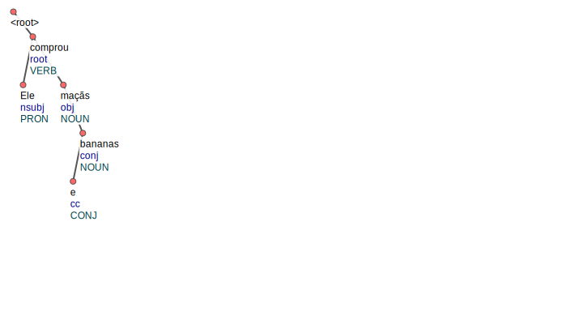

</details>

## Algoritmo de Extração de Aposto

Identifica e processa apostos em nomes próprios, gerando automaticamente triplas de extração que expressam relações de identidade (`X é Y`), mesmo quando essa relação está implícita no texto. O método cria um verbo de ligação sintético "é" para conectar entidades e seus apostos.

### 1. Inicialização

- Cria um vetor booleano para rastrear tokens já processados `vetorBooleanoTokensVisitados`
- Prepara uma pilha para busca em profundidade não-recursiva `pilhaAuxiliar`
- Configura um **token sintético de verbo de ligação**:

### 2. Identificação de Apostos

Percorre todos os tokens da sentença buscando tokens que:
- Tenham relação de dependência `appos` (aposição)
- Sejam nomes próprios (`PROPN`)
- **Não** tenham filhos com relação de conjunção (`conj`)

### 3. Construção da Estrutura Sujeito-Relação
Para cada aposto válido:
1. Cria nova instância de e adiciona à lista global `SujeitoRelacao`
2. Obtém o token pai do aposto como núcleo do sujeito:
``` java
   Token tokenNucleoSujeitoAposto = this.sentence.getSentenca().get(tokenSentenca.getHead());
```
1. Configura o verbo sintético:
   - Atribui o mesmo ID do núcleo do sujeito
   - Adiciona o aposto como filho do verbo sintético

2. Define identificadores para rastreamento:
   - Núcleo do sujeito = ID do token pai do aposto
   - Núcleo da relação = mesmo ID

### 4. Extração do Sujeito

Realiza uma busca em profundidade a partir do núcleo do sujeito:
1. 
2. Empilha o núcleo do sujeito na pilha auxiliar
2. Adiciona o token ao sujeito via `adicionaPedacoSujeitoRelacao`
3. Processa recursivamente os tokens filhos que:
   - Não foram visitados anteriormente
   - Atendem a critérios específicos de dependência:

### Exemplo de extração

**Entrada:** "O presidente Lula visitou a cidade de São Paulo durante o feriado."
**Resultado** Além da extração principal da sentença, gera a tripla adicional: "O presidente" -> "é" -> "Lula"


<details>
<summary>Ver CoNLL-U</summary>

```conll
1	O	_	DET	DET	_	2	det	_	_
2	presidente	_	NOUN	NOUN	_	4	nsubj	_	_
3	Lula	_	PNOUN	PNOUN	_	2	appos	_	_
4	visitou	_	VERB	VERB	_	0	root	_	_
5	a	_	DET	DET	_	6	det	_	_
6	cidade	_	NOUN	NOUN	_	4	obj	_	_
7	de	_	ADP	ADP	_	8	case	_	_
8	São	_	PNOUN	PNOUN	_	6	nmod	_	_
9	Paulo	_	PNOUN	PNOUN	_	8	flat	_	_
10	durante	_	ADP	ADP	_	12	case	_	_
11	o	_	DET	DET	_	12	det	_	_
12	feriado	_	NOUN	NOUN	_	4	nmod	_	_
13	.	_	.	.	_	4	punct	_	_

```

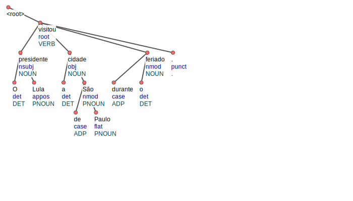

</details>

## adicionaArgumentoMarkAntesSujeito()

Este método identifica e adiciona marcadores (tokens com relação de dependência "mark") como argumentos do sujeito. Os marcadores são palavras que introduzem cláusulas subordinadas, como "se", "quando", "embora", etc.

### Funcionamento

1. Itera sobre todas as estruturas SujeitoRelacaoArgumentos extraídas
2. Para cada estrutura, obtém o token núcleo do sujeito
3. Verifica se há tokens dependentes com relação de dependência "mark"
4. Se encontrado, adiciona este token como um argumento que precede o sujeito
5. Atualiza os vetores de controle de tokens visitados

## Exemplo de estração

**Sentença** "Serras transformam toras em pranchas, máquinas ruidosas produzem painéis de madeira para portas, turistas se divertem num balneário com fontes de água quente e uma barragem hidrelétrica funciona a pleno vapor."
**Resultado** É adicionado "e uma" no sujeito "hidrelétrica" previamente extraído

<details>
<summary>Ver CoNLL-U</summary>

```conll
1	Serras	_	PNOUN	PNOUN	_	2	nsubj	_	_
2	transformam	_	VERB	VERB	_	18	nsubj	_	_
3	toras	_	NOUN	NOUN	_	2	obj	_	_
4	em	_	ADP	ADP	_	5	case	_	_
5	pranchas	_	NOUN	NOUN	_	2	nmod	_	_
6	,	_	.	.	_	7	punct	_	_
7	máquinas	_	NOUN	NOUN	_	5	conj	_	_
8	ruidosas	_	ADJ	ADJ	_	7	amod	_	_
9	produzem	_	VERB	VERB	_	18	dep	_	_
10	painéis	_	NOUN	NOUN	_	9	obj	_	_
11	de	_	ADP	ADP	_	12	case	_	_
12	madeira	_	NOUN	NOUN	_	10	nmod	_	_
13	para	_	ADP	ADP	_	14	case	_	_
14	portas	_	NOUN	NOUN	_	18	nmod	_	_
15	,	_	.	.	_	16	punct	_	_
16	turistas	_	NOUN	NOUN	_	18	nsubj	_	_
17	se	_	PRON	PRON	_	18	obj	_	_
18	divertem	_	VERB	VERB	_	0	root	_	_
19	em	_	ADP	ADP	_	21	case	_	_
20	um	_	DET	DET	_	21	det	_	_
21	balneário	_	NOUN	NOUN	_	18	nmod	_	_
22	com	_	ADP	ADP	_	23	case	_	_
23	fontes	_	NOUN	NOUN	_	31	nmod	_	_
24	de	_	ADP	ADP	_	25	case	_	_
25	água	_	NOUN	NOUN	_	23	nmod	_	_
26	quente	_	ADJ	ADJ	_	25	amod	_	_
27	e	_	CONJ	CONJ	_	28	cc	_	_
28	uma	_	PRON	PRON	_	31	mark	_	_
29	barragem	_	VERB	VERB	_	31	punct	_	_
30	hidrelétrica	_	NOUN	NOUN	_	31	nsubj	_	_
31	funciona	_	VERB	VERB	_	21	acl:relcl	_	_
32	a	_	DET	DET	_	34	det	_	_
33	pleno	_	ADJ	ADJ	_	34	amod	_	_
34	vapor	_	NOUN	NOUN	_	31	obj	_	_
35	.	_	.	.	_	18	punct	_	_


```

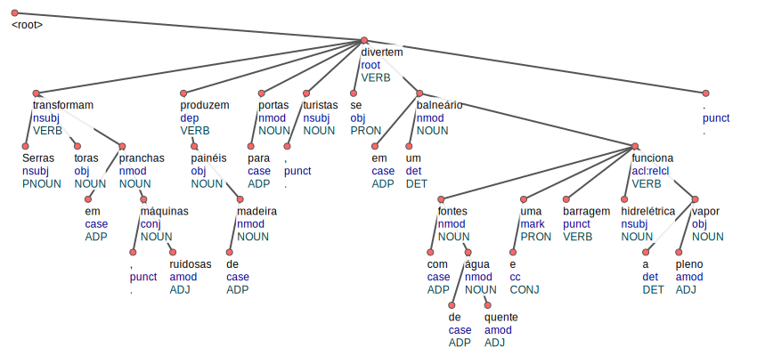

</details>

## moduloSubstituiApostoTransitividade()

Implementa o princípio de transitividade para apostos, substituindo sujeitos por seus equivalentes apostos quando apropriado.

### Funcionamento

1. Itera sobre as estruturas SujeitoRelacaoArgumentos que contêm apostos (sraComAposto)
2. Para cada estrutura, busca correspondências no conjunto principal de extrações
3. Quando encontra uma correspondência:
    - Substitui o sujeito original pelo argumento associado ao aposto
    - Define o identificador do módulo de extração como 3 (transitividade)
4. Atualiza os índices dos núcleos e vetores de controle

## Exemplo de extração  
Na frase "Pedro, CEO da empresa, anunciou novos investimentos", o método permite gerar uma extração adicional onde "CEO da empresa" substitui "Pedro" como sujeito, resultado em ", CEO de a empresa , " -> "anunciou" "novos inventimentos"

<details>
<summary>Ver CoNLL-U</summary>

```conll
1	Pedro	_	PNOUN	PNOUN	_	8	nsubj	_	_
2	,	_	.	.	_	3	punct	_	_
3	CEO	_	PNOUN	PNOUN	_	1	appos	_	_
4	de	_	ADP	ADP	_	6	case	_	_
5	a	_	DET	DET	_	6	det	_	_
6	empresa	_	NOUN	NOUN	_	3	nmod	_	_
7	,	_	.	.	_	3	punct	_	_
8	anunciou	_	VERB	VERB	_	0	root	_	_
9	novos	_	ADJ	ADJ	_	10	amod	_	_
10	investimentos	_	NOUN	NOUN	_	8	obj	_	_
11	.	_	.	.	_	8	punct	_	_

```

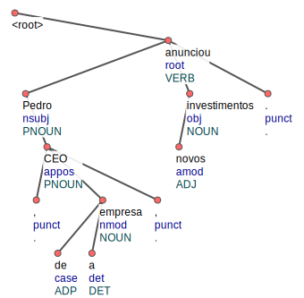

</details>

## moduloExtracaoVerboLigacao()

Especializado no tratamento de construções com verbos de ligação, separando-os para formar novas extrações.

### Funcionamento

1. Itera sobre as estruturas SujeitoRelacao extraídas
2. Para cada estrutura, cria uma cópia de trabalho
3. Identifica verbos de ligação (com relação de dependência "cop") na relação
4. Separa a relação em duas partes:
    - Parte pré-verbo de ligação (mantida na relação)
    - Parte pós-verbo de ligação (movida para o argumento)
5. Busca argumentos adicionais ligados ao verbo usando retornaArgumentoVerboLigacao()
6. Adiciona as novas extrações à lista sujeitoRelacaoArgumentos com identificador 5

## Exemplo de extração
Na sentença "Joanna Dove Hayes (Williamsport, 23 de dezembro de 1976) é um atleta barreirista e campeã olímpica norte-americana."  
Foi obtida duas novas extrações: ("Joanna Dove Hayes" -> "é" -> "atleta") e ("Joanna Dove Hayes" -> "é" -> "barreirista e campeã olímpica")

<details>
<summary>Ver CoNLL-U</summary>

```conll
1	Joanna	_	PNOUN	PNOUN	_	15	nsubj	_	_
2	Dove	_	PNOUN	PNOUN	_	1	flat	_	_
3	Hayes	_	PNOUN	PNOUN	_	1	flat	_	_
4	(	_	.	.	_	5	punct	_	_
5	Williamsport	_	PNOUN	PNOUN	_	1	appos	_	_
6	,	_	.	.	_	5	punct	_	_
7	23	_	NUM	NUM	_	5	nmod	_	_
8	de	_	ADP	ADP	_	9	case	_	_
9	dezembro	_	PNOUN	PNOUN	_	7	nmod	_	_
10	de	_	ADP	ADP	_	11	case	_	_
11	1976	_	NUM	NUM	_	9	nmod	_	_
12	)	_	.	.	_	5	punct	_	_
13	é	_	VERB	VERB	_	15	cop	_	_
14	um	_	DET	DET	_	15	det	_	_
15	atleta	_	NOUN	NOUN	_	0	root	_	_
16	barreirista	_	ADJ	ADJ	_	15	amod	_	_
17	e	_	CONJ	CONJ	_	18	cc	_	_
18	campeã	_	NOUN	NOUN	_	16	conj	_	_
19	olímpica	_	ADJ	ADJ	_	18	amod	_	_
20	norte	_	ADJ	ADJ	_	22	amod	_	_
21	-	_	.	.	_	22	punct	_	_
22	americana	_	ADJ	ADJ	_	18	amod	_	_
23	.	_	.	.	_	15	punct	_	_

```

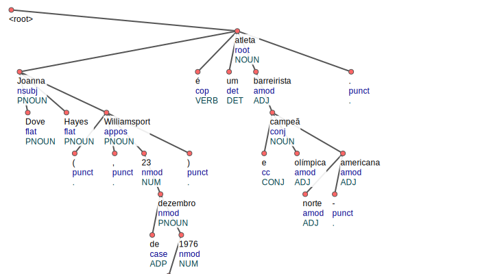

</details>

## eliminaPreposicaoAntesSujeito()

Remove preposições que aparecem indevidamente no início de um sujeito extraído.

### Funcionamento

1. Itera sobre todas as estruturas SujeitoRelacaoArgumentos
2. Para cada sujeito, verifica se o primeiro token é:
    - Uma preposição (categoria "ADP") que não seja um marcador ligado ao núcleo
    - Uma conjunção coordenativa (relação "cc")
3. Se a condição for verdadeira, remove o token do início do sujeito
4. Atualiza os índices e vetores de controle conforme necessário

## Exemplo de extração

Na sentença "Conflyto voltou ao passado perseguindo seu arqui-inimigo Cable e foi o responsável pela liberação do Vírus Legado, que matou inúmeros mutantes."

O sujeito inicialmente é "de o Vírus Legado", mas o "de" é removido restando apenas "o Vírus Legado" 

<details>
<summary>Ver CoNLL-U</summary>

```conll
1	Conflyto	_	PNOUN	PNOUN	_	2	nsubj	_	_
2	voltou	_	VERB	VERB	_	0	root	_	_
3	a	_	ADP	ADP	_	5	case	_	_
4	o	_	DET	DET	_	5	det	_	_
5	passado	_	NOUN	NOUN	_	2	nmod	_	_
6	perseguindo	_	VERB	VERB	_	2	acl:part	_	_
7	seu	_	DET	DET	_	8	det:poss	_	_
8	arqui	_	NOUN	NOUN	_	6	obj	_	_
9	-	_	.	.	_	8	punct	_	_
10	inimigo	_	NOUN	NOUN	_	8	flat	_	_
11	Cable	_	PNOUN	PNOUN	_	8	appos	_	_
12	e	_	CONJ	CONJ	_	13	cc	_	_
13	foi	_	VERB	VERB	_	11	conj	_	_
14	o	_	DET	DET	_	15	det	_	_
15	responsável	_	NOUN	NOUN	_	8	nmod	_	_
16	por	_	ADP	ADP	_	18	case	_	_
17	a	_	DET	DET	_	18	det	_	_
18	liberação	_	NOUN	NOUN	_	15	nmod	_	_
19	de	_	ADP	ADP	_	21	case	_	_
20	o	_	DET	DET	_	21	det	_	_
21	Vírus	_	PNOUN	PNOUN	_	18	nmod	_	_
22	Legado	_	PNOUN	PNOUN	_	21	flat	_	_
23	,	_	.	.	_	25	punct	_	_
24	que	_	PRON	PRON	_	25	nsubj	_	_
25	matou	_	VERB	VERB	_	21	acl:relcl	_	_
26	inúmeros	_	ADJ	ADJ	_	27	amod	_	_
27	mutantes	_	NOUN	NOUN	_	25	obj	_	_
28	.	_	.	.	_	2	punct	_	_

```

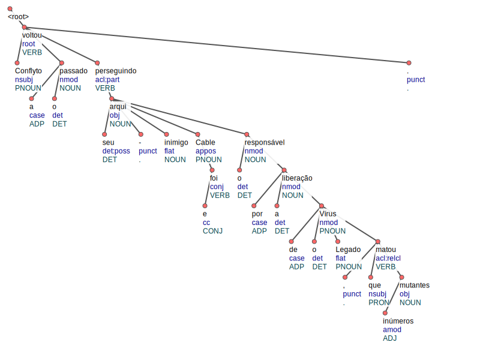

</details>

## excluiSraSujeitoErrado()

Filtra extrações que contêm sujeitos que os núcleos são pronomes "que" ou artigos

### Funcionamento

1. Itera pela lista de sujeitoRelacaoArgumentos
2. Verifica o núcleo do sujeito de cada extração
3. Remove a extração se o núcleo do sujeito for:
    - O pronome relativo "que"
    - Os artigos definidos "a" ou "o" isolados
4. Trata casos especiais onde o núcleo do sujeito foi originalmente um pronome relativo dentro de uma cláusula acl:relcl


## excluiSraRelacaoSemVerbo()

Remove extrações cuja relação não contém nenhum verbo.

### Funcionamento

1. Itera pela lista de sujeitoRelacaoArgumentos
2. Para cada extração, verifica se algum token na relação possui categoria gramatical "VERB"
3. Se nenhum verbo for encontrado, remove a extração da lista
4. Trata casos especiais onde a relação é composta apenas por nomes próprios, movendo-os para os argumentos quando apropriado


## eliminaTokenPontuacaoErrada()

Identifica e remove tokens de pontuação que não contribuem para a correta representação das relações extraídas.

### Funcionamento

1. Itera sobre as estruturas SujeitoRelacaoArgumentos
2. Para cada estrutura, analisa os tokens de pontuação presentes no sujeito, relação e argumentos
3. Remove pontuações que:
    - Não possuem valor semântico para a extração
    - Estão em posições inadequadas (como pontuações soltas no meio da relação)
    - Não fazem parte das pontuações válidas definidas pelo sistema (parênteses, chaves, colchetes, apóstrofos e vírgulas em contextos específicos)

### Importância
Limpa as extrações de sinais de pontuação desnecessários que podem dificultar a interpretação ou processamento posterior das triplas extraídas.

## excluiExtracoesRepetidas()

Elimina redundâncias na lista de extrações, removendo triplas duplicadas.

### Funcionamento

1. Itera sobre a lista de sujeitoRelacaoArgumentos
2. Para cada par de extrações, compara:
    - Tokens do sujeito
    - Tokens da relação
    - Tokens dos argumentos
3. Se duas extrações forem consideradas equivalentes (mesmo conteúdo semântico), mantém apenas uma delas
4. Considera variações como diferenças na ordem dos tokens ou presença/ausência de tokens funcionais

# Dicionário de Termos Técnicos

- **HEAD**: Token hierarquicamente superior ao atual
- **deprel**: Relação de dependência com o HEAD
- **postag**: Categoria gramatical do token
- **ID**: Identificador único do token (ordem crescente)

# Notas de Implementação

## Pontuações Válidas
As seguintes pontuações são consideradas válidas durante o processamento:
- Parênteses: `(` `)`
- Chaves: `{` `}`
- Colchetes: `[` `]`
- Apóstrofo: `'`
- Vírgula: `,`

## Tratamento de Casos Especiais

1. **Múltiplos Núcleos**
   - Sistema identifica e ajusta quando existem dois verbos na relação
       - Define hierarquia baseada em sujeitos e relações adicionais

2. **Substituição de Núcleo**
   - Permite ajuste dinâmico do núcleo quando token mais relevante é encontrado

## Considerações de Performance
- Uso de `ArrayDeque` para armazenamento eficiente
- Vetores booleanos para controle de visitação
- Sistema de clonagem otimizado para cópias profundas